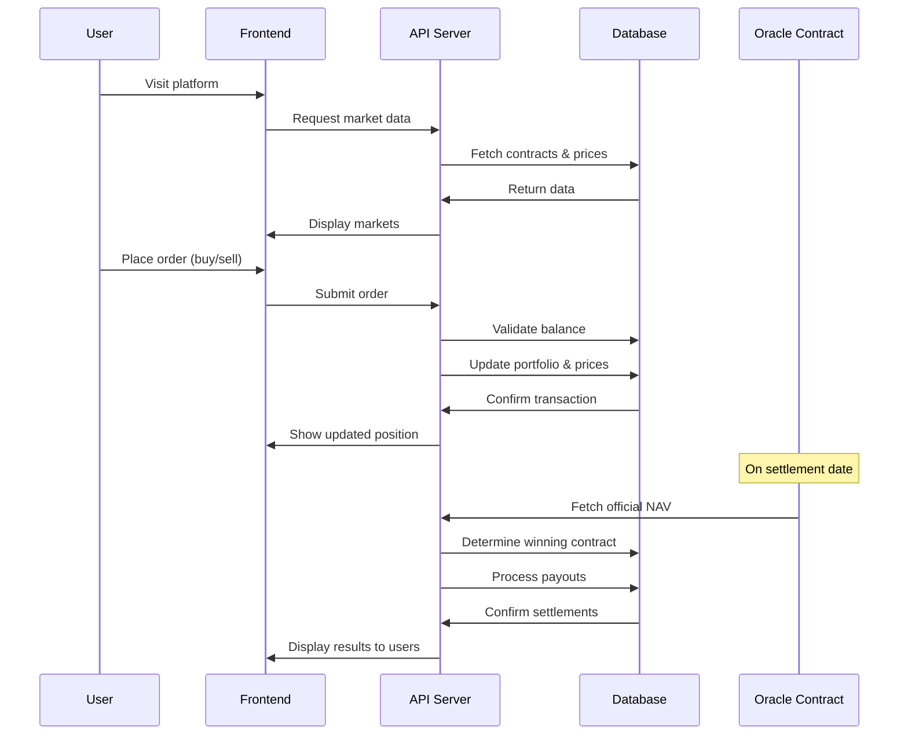

# XFT NAV BINARY OPTION MARKET


### NAV RANGES
- Contract A: NAV below $20
- Contract B: NAV $20-$22
- Contract C: NAV $22-$24
- Contract D: NAV $24-$26
- Contract E: NAV above $26


### PROJECT TREE
```
index.html
script.js
style.css
assets/
docs/
```




### SEQUENCES

```
Market Data: User loads site → server fetches current contract prices → UI displays markets

Trading: User submits order → server validates funds → updates user portfolio and market prices → confirms transaction

Settlement: Oracle retrieves official NAV → system identifies winning contract → processes payouts to holders → notifies users
```
